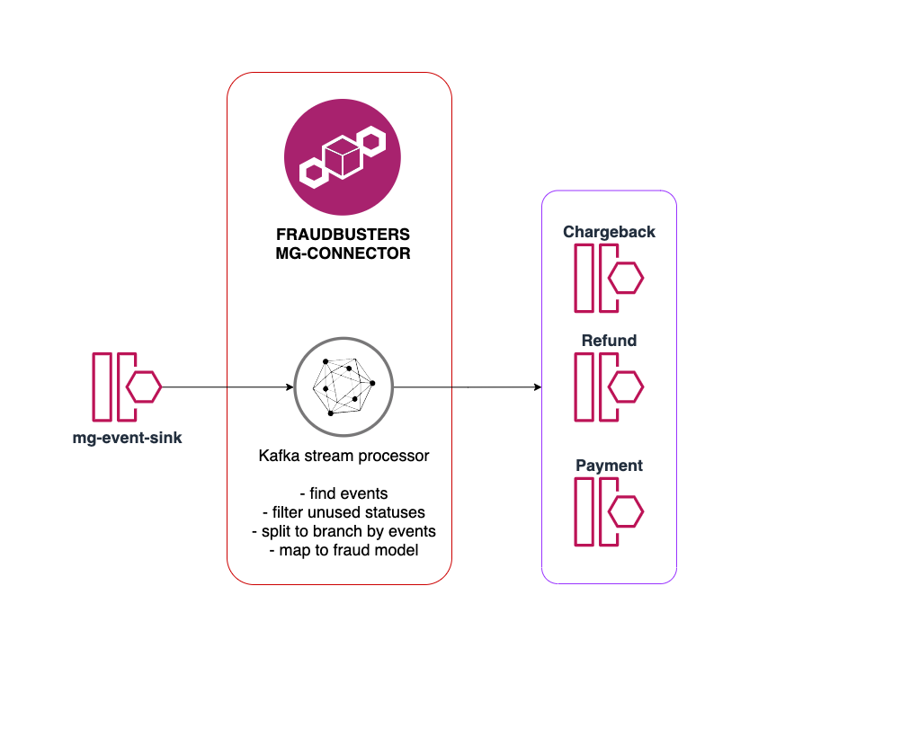

# fraudbusters-mg-connector

Service for stream process mg-event-sink to local fraud model.

#### Stream topic scheme

Service read data from mg-event-sink using protocol [machinegun_proto](https://github.com/rbkmoney/machinegun_proto/blob/master/proto/event_sink.thrift).
Find need events:
- chargeback (with statuses - accepted, rejected, cancelled)
- refund (with statuses - succeeded, failed)
- payment (with statuses - processed, captured, cancelled, failed)

Map to local fraudbusters model [fraudbusters_proto](https://github.com/rbkmoney/fraudbusters-proto/blob/master/proto/fraudbusters.thrift) and split to topics by events type

- chargeback
- refund
- payment

